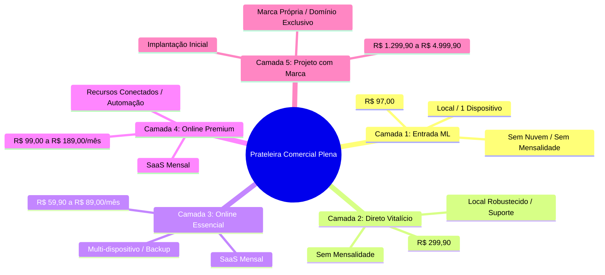

# Matriz Comercial Canônica - Fase A.1: Auditoria e Consolidação da Prateleira Comercial

**Data:** 2026-07-22  
**Autor:** Agente Dev Sênior Antigravity  
**Status:** Auditoria Revisada e Consolidada (Fase A.1 - Sem alterações de código)  
**Projeto:** Sistemas de Gestão (Plena Informática)

---

## 1. Resumo Executivo Revisado

A presente auditoria estruturada consolida o levantamento comercial dos quatro sistemas Plena (**Gestão Assistência**, **Gestão Barbearia**, **Gestão Beleza** e **Gestão Gastro**), delimitando com clareza a separação entre:
1. **Atual Observado:** O que está efetivamente implementado nas landing pages públicas, no Painel Admin, nas APIs PHP, nos bancos de dados (JSON local e Supabase) e nos módulos de evolução existentes.
2. **Canônico Recomendado:** A proposta futura de padronização comercial unificada para balizar o Painel Admin como controle de prateleira, a Central de Evolução 2.0 nos sistemas, a geração de licenças, o funil de leads e o provisionamento SaaS.

### Principais Diagnósticos da Auditoria
- **Descompasso entre Página Geral e Landings Específicas:** A página geral `tecnologia.html` apresenta planos "a partir de R$ 59,90/mês" de forma genérica para Assistência, Barbearia e Beleza. Porém, as landings específicas trazem valores e nomes distintos (ex: Assistência especifica R$ 97,90/mês para Multiusuário e R$ 149,90/mês para On-line Avançado).
- **Projetos Personalizados (Com Marca):** As landings específicas fixam valores de implantação inicial de R$ 1.299,90 (Assistência), R$ 1.699,90 (Barbearia), R$ 1.699,90 (Beleza) e R$ 4.999,90 (Gastro).
- **Inexistência de Entrada ML no Gastro:** O Gestão Gastro opera atualmente 100% como SaaS/Supabase (`public.provision_saas_tenant`). Não possui produto local/vitalício para o Mercado Livre. A oferta "Gastro Balcão Local" é estritamente uma proposta futura.
- **Omissão no Catálogo Local do Admin:** O catálogo fallback do Painel Admin (`admin/index.html`) omite o Gestão Assistência da lista de planos SaaS e diverge nos preços do Barbearia (R$ 59 / R$ 99), Beleza (R$ 69 / R$ 129) e Gastro (R$ 97 / R$ 197).
- **Funil de Leads Desconectado:** O registro de leads na API `api_licenca_ml.php` grava a *feature* clicada, mas não grava o plano alvo nem gera vinculo automatizado/assistido com o provisionamento de tenant no Supabase.

---

## 2. Tabela Comparativa: Atual Observado vs. Canônico Recomendado

| Dimensão Comercial | Atual Observado | Canônico Recomendado (Proposta Futura) |
| :--- | :--- | :--- |
| **Página Geral (`tecnologia.html`)** | Anuncia "planos a partir de R$ 59,90/mês" para Assistência, Barbearia e Beleza, e "R$ 89/mês" para Gastro. | Apresentar os planos de entrada reais de cada produto ou o valor inicial de cada prateleira de forma alinhada às landings específicas. |
| **Nomenclatura de Planos (Assistência)** | Landing específica usa `Multiusuário` (R$ 97,90/mês) e `On-line Avançado` (R$ 149,90/mês). | Padronizar como `Online Essencial` (R$ 59,90 ou R$ 97,90) e `Online Premium` (R$ 149,90). *(Decisão do Arquiteto pendente)* |
| **Nomenclatura de Planos (Barbearia/Beleza)** | Admin/APIs usam `basic` (Básico) e `premium` (Premium Online). Landings usam `Pro` / `Premium`. | Padronizar como `Online Essencial` (código `basic`) e `Online Premium` (código `premium`). |
| **Nomenclatura de Planos (Gastro)** | Landing usa `Essencial` (R$ 89), `Profissional` (R$ 189) e `Gestão` (R$ 329). Admin usa `Básico` (R$ 97) e `Premium` (R$ 197). | Padronizar como `Online Essencial` (R$ 89,00) e `Online Premium` (R$ 189,00), mantendo `Gestão/Enterprise` para planos superiores ou sob consulta. |
| **Produto ML de Entrada (Gastro)** | **Inexistente.** Não há produto local/vitalício do Gastro no Mercado Livre. | Criar no futuro o "Gestão Gastro Balcão Local" (PDV Balcão + Caixa em 1 PC), mantendo Mesas, KDS e Garçom Mobile no SaaS. |
| **Projetos Personalizados (Implantação)** | Landings fixam: Assistência (R$ 1.299,90), Barbearia (R$ 1.699,90), Beleza (R$ 1.699,90), Gastro (R$ 4.999,90). | Cadastrar estes valores como referência base no catálogo do Admin sob a camada `custom_project`. |
| **Catálogo no Admin UI** | Trata apenas de planos SaaS mensais (`basic`, `premium`, `trial`) e omite o Assistência no fallback local JS. | Expandir o catálogo para incluir as 5 camadas comerciais (ML, Direto, Essencial, Premium e Marca) para os 4 sistemas. |
| **Leads de Evolução** | Registram `system_id`, `feature_key` e contagem de cliques. Não gravam `target_plan_code` nem `current_plan_code`. | Gravar o plano de origem e o plano alvo de interesse, criando botão `Preparar WhatsApp` e atalho para `Provisionar Tenant`. |

---

## 3. Matriz por Sistema (Atual Observado vs. Canônico Recomendado)

### 3.1. Gestão Assistência

| Camada Comercial | Atual Observado | Canônico Recomendado (Proposta Futura) |
| :--- | :--- | :--- |
| **1. Produto Entrada ML** | **Existe.** `ml_lifetime` - R$ 97,00 (ML). Licença local para 1 computador. O.S., Peças, PDV, Caixa, Clientes e Relatórios simples. | `Gestão Assistência Pro - ML Vitalício` (R$ 97,00 ML). Manter escopo local sem promessa de nuvem/portal. |
| **2. Site Vitalício** | **Existe.** Landing específica traz `Licença Vitalícia`: **R$ 299,90 pagamento único**. | `Gestão Assistência Pro - Direto Vitalício` (R$ 299,90). Inclui suporte inicial de implantação e exportações locais. |
| **3. Online Essencial** | **Existe com o nome:** `Multiusuário` - **R$ 97,90/mês** (na landing `assistencia-pro.html`). | `Gestão Assistência Online Essencial` (Padronização sugerida de nome, avaliando faixa de R$ 59,90 a R$ 97,90/mês). |
| **4. Online Premium** | **Existe com o nome:** `On-line Avançado` - **R$ 149,90/mês** (na landing `assistencia-pro.html`). | `Gestão Assistência Online Premium` (Padronização sugerida de nome: R$ 149,90/mês. Inclui Portal do Cliente O.S. e WhatsApp). |
| **5. Projeto com Marca** | **Existe.** Landing traz `Sistema Completo com sua Marca`: **R$ 1.299,90 implantação inicial**. | `Gestão Assistência Enterprise` (R$ 1.299,90 implantação + mensalidade). Domínio próprio e marca exclusiva. |

---

### 3.2. Gestão Barbearia

| Camada Comercial | Atual Observado | Canônico Recomendado (Proposta Futura) |
| :--- | :--- | :--- |
| **1. Produto Entrada ML** | **Existe.** `ml_lifetime` - R$ 97,00 (ML). Licença local para 1 computador. Agenda por barbeiro, Comissões, PDV, Caixa. | `Gestão Barbearia Pro - ML Vitalício` (R$ 97,00 ML). Foco em organização local sem agenda pública online. |
| **2. Site Vitalício** | **Existe.** `direct_lifetime` - R$ 299,90 pagamento único. | `Gestão Barbearia Pro - Direto Vitalício` (R$ 299,90). Inclui suporte de configuração inicial de comissões. |
| **3. Online Essencial** | **Existe.** Admin/SaaS marca `Básico`: R$ 59,00/mês. Landing Tech menciona a partir de R$ 59,90/mês. | `Gestão Barbearia Online Essencial` (R$ 59,90/mês). Agenda Sincronizada, Multiusuário e Backup em nuvem. |
| **4. Online Premium** | **Existe.** Admin/SaaS marca `Premium Online`: R$ 99,00/mês. | `Gestão Barbearia Online Premium` (R$ 99,00/mês). Inclui Agendamento Online pelos Clientes, Página Pública e WhatsApp. |
| **5. Projeto com Marca** | **Existe.** Landing traz `Sistema com sua Marca`: **R$ 1.699,90 implantação inicial**. | `Gestão Barbearia Enterprise` (R$ 1.699,90 implantação + mensalidade). App/PWA e domínio próprio da barbearia. |

---

### 3.3. Gestão Beleza

| Camada Comercial | Atual Observado | Canônico Recomendado (Proposta Futura) |
| :--- | :--- | :--- |
| **1. Produto Entrada ML** | **Existe.** `ml_lifetime` - R$ 97,00 (ML). Licença local para 1 computador. Agenda por especialista, Pacotes, Checkout, Caixa. | `Gestão Beleza Pro - ML Vitalício` (R$ 97,00 ML). Foco em rotina local sem agendamento online. |
| **2. Site Vitalício** | **Existe.** `direct_lifetime` - R$ 299,90 pagamento único. | `Gestão Beleza Pro - Direto Vitalício` (R$ 299,90). |
| **3. Online Essencial** | **Existe.** Admin/SaaS marca `Básico`: R$ 69,00/mês. Landing Tech menciona a partir de R$ 59,90/mês. | `Gestão Beleza Online Essencial` (Padronizar em R$ 59,90 ou R$ 69,00/mês). Agenda, Pacotes e Backup. |
| **4. Online Premium** | **Existe.** Admin/SaaS marca `Premium`: R$ 129,00/mês. | `Gestão Beleza Online Premium` (Padronizar em R$ 99,00 ou R$ 129,00/mês). Agendamento Online, Página Pública e Automações. |
| **5. Projeto com Marca** | **Existe.** Landing traz `Sistema com sua Marca`: **R$ 1.699,90 implantação inicial**. | `Gestão Beleza Enterprise` (R$ 1.699,90 implantação + mensalidade). Domínio próprio para salão/estética. |

---

### 3.4. Gestão Gastro

| Camada Comercial | Atual Observado | Canônico Recomendado (Proposta Futura) |
| :--- | :--- | :--- |
| **1. Produto Entrada ML** | **NÃO EXISTE HOJE.** Gastro só possui arquitetura SaaS/Supabase em nuvem. | **PROPOSTA FUTURA:** `Gestão Gastro Balcão Local` (estimado em R$ 147,00 ML). Apenas PDV Balcão + Caixa local. |
| **2. Site Vitalício** | **NÃO EXISTE HOJE.** | Manter sem produto vitalício no site por enquanto ou avaliar após validação da entrada ML. |
| **3. Online Essencial** | **Existe.** Landing Gastro marca **R$ 89,00/mês** (`Essencial`). Admin SaaS marca **R$ 97,00/mês** (`basic`). | `Gestão Gastro Online Essencial` (Padronizar em R$ 89,00/mês). PDV, Mesas/Comandas, Garçom Mobile e Cardápio Digital. |
| **4. Online Premium** | **Existe.** Landing Gastro marca **R$ 189,00/mês** (`Profissional`). Admin SaaS marca **R$ 197,00/mês** (`premium`). | `Gestão Gastro Online Premium` (Padronizar em R$ 189,00/mês). Inclui KDS (Cozinha), Delivery, Pedidos Online e BI. |
| **5. Projeto com Marca** | **Existe.** Landing Gastro marca `Projeto Personalizado`: **R$ 4.999,90 implantação inicial**. | `Gestão Gastro Enterprise` (R$ 4.999,90 implantação + mensalidade). Marca própria, cardápio exclusivo e servidor dedicado. |

---

## 4. Matriz por Plano e Camada Comercial (Consolidada)

---

## 5. Auditoria de Divergências Reais

### 5.1. Divergência entre Página Geral (`tecnologia.html`) e Landings Específicas
- `tecnologia.html` simplifica a oferta dizendo "planos a partir de R$ 59,90/mês" para Assistência, Barbearia e Beleza.
- As landings específicas detalham a prateleira real:
  - **Assistência (`assistencia-pro.html`):** R$ 299,90 (Vitalício), R$ 97,90/mês (Multiusuário), R$ 149,90/mês (On-line Avançado), R$ 1.299,90 (Marca).
  - **Barbearia (`barbearia-premium.html`):** R$ 1.699,90 (Marca).
  - **Beleza (`beleza-spa.html`):** R$ 1.699,90 (Marca).
  - **Gastro (`gestao-gastro.html`):** R$ 89/mês (Essencial), R$ 189/mês (Profissional), R$ 329/mês (Gestão), R$ 4.999,90 (Marca).
- **Necessidade:** Harmonizar as chamadas da página geral de tecnologia para que o usuário não veja "R$ 59,90" na capa e encontre "R$ 97,90" ou "R$ 299,90" ao clicar na landing específica.

### 5.2. Divergência entre Landings Específicas e Painel Admin / APIs
- **Gestão Assistência Omitido no Admin:** O `SAAS_CATALOG_FALLBACK` no `admin/index.html` não contempla o Assistência.
- **Preços no Admin vs. Landings:**
  - Barbearia: Admin marca R$ 59 / R$ 99. Landings mencionam R$ 59,90.
  - Beleza: Admin marca R$ 69 / R$ 129. Landings mencionam R$ 59,90.
  - Gastro: Admin marca R$ 97 / R$ 197. Landing específica marca R$ 89 / R$ 189 / R$ 329.
  - Assistência: Landing específica marca R$ 97,90 / R$ 149,90.

---

## 6. Decisões Pendentes do Arquiteto

As seguintes 7 decisões estratégicas precisam ser validadas formalmente pelo Arquiteto para liberar a Fase B:

> [!IMPORTANT]
> **Decisão 1: Alinhamento de Preços Mensais da Assistência**  
> Manter os preços observados na landing da Assistência (R$ 97,90/mês Multiusuário e R$ 149,90/mês On-line Avançado) ou padronizar na tabela comum de R$ 59,90/mês (Essencial) e R$ 99,00/mês (Premium)?

> [!IMPORTANT]
> **Decisão 2: Tabela Canônica de Preços do Gastro**  
> Definir se o Gastro SaaS adotará R$ 89,00/mês (Essencial) e R$ 189,00/mês (Premium) no Admin/API, eliminando a divergência dos R$ 97/R$ 197 atuais do Admin.

> [!IMPORTANT]
> **Decisão 3: Nomenclatura Canônica Unificada**  
> Aprovar a padronização das ofertas de upgrade em todos os sistemas sob os nomes públicos `Online Essencial` (código `basic`) e `Online Premium` (código `premium`).

> [!IMPORTANT]
> **Decisão 4: Modelo de Entrada ML do Gestão Gastro**  
> Aprovar a criação futura da especificação "Gastro Balcão Local" para entrada no Mercado Livre.

> [!IMPORTANT]
> **Decisão 5: Inclusão do Assistência no Catálogo SaaS do Admin**  
> Inserir formalmente o Gestão Assistência no catálogo local JS e nas tabelas do Supabase geridas pelo Admin.

> [!IMPORTANT]
> **Decisão 6: Captura de Metadados nos Leads de Evolução**  
> Atualizar `api_licenca_ml.php` e os scripts dos sistemas para capturar `current_plan_code`, `target_plan_code` e permitir contato via WhatsApp.

> [!IMPORTANT]
> **Decisão 7: Fluxo de Conversão Assistida (Lead -> Tenant)**  
> Conectar o status `convertido` no Admin a um atalho de preenchimento automático na aba `Clientes SaaS`.

---

## 7. Recomendações para a Fase B

Uma vez aprovadas as decisões pelo Arquiteto, a implementação em código (Fase B) deverá seguir a ordem:

1. **Fase B.1 (Catálogo Unificado):** Atualizar `SAAS_CATALOG_FALLBACK` em `admin/index.html` e `getSaasCatalog()` em `api_provisioning.php` para paridade total de nomes, preços e módulos.
2. **Fase B.2 (Central de Evolução 2.0 nos Sistemas):** Atualizar `evolution.js` e `app_core.js` exibindo o card da Licença Atual e a comparação entre os planos Essencial e Premium.
3. **Fase B.3 (Evolução do Admin & Leads):** Incluir suporte aos novos campos de leads na API PHP e criar ação `Preparar WhatsApp` e `Provisionar Tenant` no Painel Admin.
4. **Fase B.4 (Especificação Gastro ML):** Elaborar a especificação do produto Gastro Balcão Local.

---

## 8. Riscos de Avançar sem Aprovação

> [!CAUTION]
> **Risco Comercial:** Apresentar preços conflitantes ao cliente (ex: R$ 59,90 na página geral, R$ 97,90 na landing da assistência, e R$ 69,00 na cobrança do Admin).

> [!CAUTION]
> **Risco de Escopo:** Prometer recursos como *Portal do Cliente O.S.* ou *KDS* e o provisionamento SaaS ser efetuado sem os respectivos módulos habilitados no Supabase.

> [!CAUTION]
> **Risco Operacional:** Criar débitos técnicos tentando alterar o comportamento do Gastro sem ter definido a separação entre a versão local e a versão SaaS.

---
*Relatório revisado em conformidade com as diretrizes da Fase A.1. Nenhuma linha de código ou arquivo de configuração foi alterado nesta etapa.*
